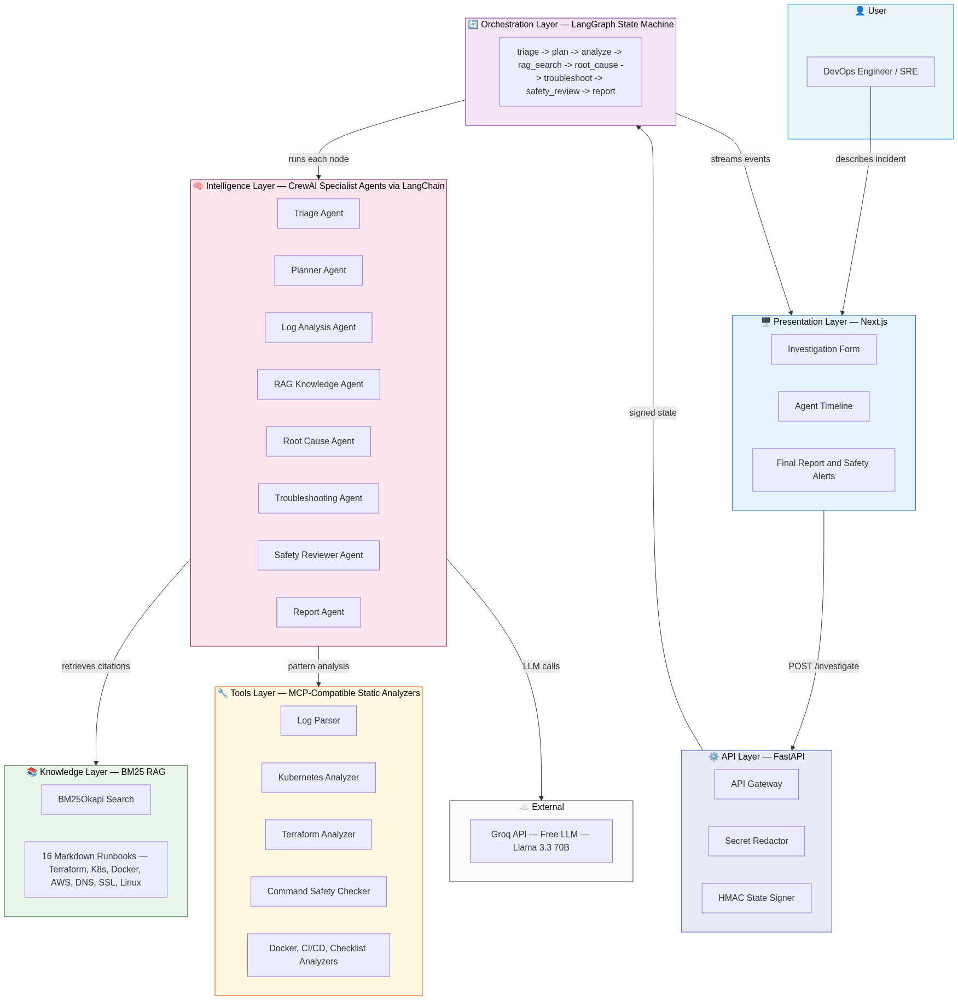

# 🤖 Agentic DevOps Troubleshooting Assistant — Complete Project Overview

> A plain-English, end-to-end explanation of every aspect of this project, written so anyone can understand it — technical or not.

---

## 🧠 Wait — Can't I Just Ask ChatGPT?

This is the most important question to answer first.

**Yes, you could paste an error into ChatGPT.** But here's what happens:

| What You Need | ChatGPT / Basic LLM | This Project |
|---|---|---|
| "What is wrong?" | Guesses based on your text alone | ✅ **Triage Agent** classifies the issue by technology, severity, and affected services |
| "What should I check first?" | Gives a generic checklist | ✅ **Planner Agent** creates an ordered, incident-specific diagnostic plan |
| "Scan my logs for errors" | Reads what you paste, may miss patterns | ✅ **Static log parser tool** pattern-matches errors/warnings — no LLM needed |
| "Check my Kubernetes YAML" | Reads what you paste | ✅ **Kubernetes analyzer tool** detects real misconfigurations deterministically |
| "What does the runbook say?" | Halluminates or makes up steps | ✅ **BM25 RAG** pulls citations from 16 real runbook files — real filenames, real sections |
| "What is the root cause?" | One-shot guess | ✅ **Root Cause Agent** ranks probable causes with evidence from logs + runbooks |
| "Give me fix commands" | Lists commands with no safety check | ✅ **Safety Reviewer Agent** flags every dangerous command before you see it |
| "I ran the command, now what?" | Starts over from scratch | ✅ **Stateless continuation** — picks up exactly where you left off |
| "Don't expose my passwords" | You have to manually redact | ✅ **Auto secret redaction** strips keys/tokens before any LLM call |
| "Give me a final report" | You copy-paste everything yourself | ✅ **Report Agent** writes a complete structured incident report |

**The core difference:** A plain LLM is a *single-turn question answerer*. This project is a *structured, multi-step, evidence-based investigation system* — like having a team of senior SREs working together on your incident.

---

## 🗺️ High-Level Architecture

> The diagram below shows every layer of the system and how they connect — from the user all the way to the LLM and back.



---

## 🏗️ ASCII Layer View

```
╔══════════════════════════════════════════════════════════════════════════════════╗
║                          AGENTIC DEVOPS ASSISTANT                              ║
╠══════════════════════════════════════════════════════════════════════════════════╣
║                                                                                ║
║  ┌─────────────────────────────────────────────────────────────────────────┐  ║
║  │                        PRESENTATION LAYER                               │  ║
║  │                      Next.js  (Frontend UI)                             │  ║
║  │                                                                         │  ║
║  │   📋 Investigation Form  │  🕒 Agent Timeline  │  📊 Root Cause Panel   │  ║
║  │   📄 Final Report        │  ⚠️  Safety Alerts   │  🔍 Diagnostic Panel   │  ║
║  └────────────────────────────────┬────────────────────────────────────────┘  ║
║                                   │  HTTP / REST API                          ║
║  ┌────────────────────────────────▼────────────────────────────────────────┐  ║
║  │                          API LAYER                                      │  ║
║  │                      FastAPI  (Backend)                                 │  ║
║  │                                                                         │  ║
║  │   POST /investigate   │  POST /continue   │  POST /upload               │  ║
║  │   POST /rag/search    │  POST /analyze    │  GET  /health               │  ║
║  └────────────────────────────────┬────────────────────────────────────────┘  ║
║                                   │                                           ║
║  ┌────────────────────────────────▼────────────────────────────────────────┐  ║
║  │                       ORCHESTRATION LAYER                               │  ║
║  │                   LangGraph  (State Machine)                            │  ║
║  │                                                                         │  ║
║  │   triage → plan → analyze → rag_search → root_cause →                  │  ║
║  │                          troubleshoot → safety_review → report          │  ║
║  │                                                                         │  ║
║  │   🔐 HMAC-signed stateless JSON  (no DB, no Redis needed)              │  ║
║  └──────────┬──────────────────────────────────────────────┬──────────────┘  ║
║             │                                              │                  ║
║  ┌──────────▼──────────────────────┐    ┌─────────────────▼──────────────┐  ║
║  │      INTELLIGENCE LAYER         │    │       KNOWLEDGE LAYER           │  ║
║  │   CrewAI  ×  LangChain × Groq  │    │      BM25 RAG  +  Runbooks      │  ║
║  │                                 │    │                                  │  ║
║  │  🧑‍💼 Triage Agent               │    │  📚 16 Markdown runbooks         │  ║
║  │  🗂️  Planner Agent              │    │  🔍 BM25Okapi keyword search    │  ║
║  │  🔬 Log Analysis Agent          │    │  🏷️  Real filename citations     │  ║
║  │  📖 RAG Knowledge Agent         │    │  ⚡ Works without any LLM        │  ║
║  │  🎯 Root Cause Agent            │    └──────────────────────────────────┘  ║
║  │  🔧 Troubleshooting Agent       │                                          ║
║  │  🛡️  Safety Reviewer Agent      │    ┌──────────────────────────────────┐  ║
║  │  📝 Report Agent                │    │       TOOLS LAYER                │  ║
║  └─────────────────────────────────┘    │  MCP-Compatible Static Analyzers │  ║
║                                         │                                   │  ║
║                                         │  🪵 Log Parser                   │  ║
║                                         │  🏗️  Terraform Analyzer           │  ║
║                                         │  ☸️  Kubernetes Analyzer          │  ║
║                                         │  🐳 Dockerfile Analyzer          │  ║
║                                         │  🔄 CI/CD Analyzer               │  ║
║                                         │  🛡️  Command Safety Checker      │  ║
║                                         │  ✅ Diagnostic Checklist          │  ║
║                                         │  📖 Runbook Search               │  ║
║                                         └──────────────────────────────────┘  ║
╠══════════════════════════════════════════════════════════════════════════════════╣
║                            INFRASTRUCTURE                                      ║
║         Vercel (Frontend + Backend)  ·  Groq API (Free LLM)                   ║
╚══════════════════════════════════════════════════════════════════════════════════╝
```

---

## 🏗️ The 5 Layers — Explained Simply

---

### 1️⃣ Presentation Layer — *What the user sees*
**Technology: Next.js (React)**

This is the website/UI. The user:
- Fills in a form describing their DevOps problem (e.g., "My Kubernetes pods keep crashing")
- Pastes in their logs or config files
- Watches a live **Agent Timeline** showing each specialist agent working in real-time
- Sees a **Root Cause Panel** with ranked, evidence-backed causes
- Gets a **Final Report** they can download

> Think of it like a patient portal — you describe symptoms, doctors work behind the scenes, you get a diagnosis.

---

### 2️⃣ API Layer — *The gateway*
**Technology: FastAPI (Python)**

The backend API sits between the UI and the intelligence. It:
- Receives the problem description, logs, and config from the UI
- **Redacts secrets automatically** (passwords, API keys, tokens) before anything reaches the LLM
- Enforces size limits (logs ≤ 50 KB, configs ≤ 30 KB)
- Routes requests to the orchestration engine
- Returns results back to the UI

> Think of it like a hospital reception desk — it checks you in, redacts personal info from forms, and routes you to the right department.

---

### 3️⃣ Orchestration Layer — *The workflow engine*
**Technology: LangGraph**

This is the brain that controls *which agent runs in what order*. It is a **state machine** — meaning it has defined steps and only moves forward when each step is done correctly.

**The pipeline:**
```
Triage → Plan → Analyze → RAG Search → Root Cause → Troubleshoot → Safety Review → Report
```

A key innovation: **stateless continuation**. The entire investigation state is packaged as a cryptographically signed (HMAC-SHA256) JSON blob. This means:
- **No database needed** — state travels with the request
- **No Redis needed** — nothing is stored on the server
- Users can **pause and resume** an investigation by providing new diagnostic output
- Tampering with the state is detected and rejected

> Think of it like a relay race where each runner (agent) passes a baton (signed state) to the next.

---

### 4️⃣ Intelligence Layer — *The specialist agents*
**Technology: CrewAI + LangChain + Groq LLM**

This is where the actual AI reasoning happens. There are **8 specialist agents**, each with a defined role, goal, and backstory (like a job description for an AI):

| Agent | What It Does |
|---|---|
| 🧑‍💼 **Triage** | Classifies the issue — what technology, how severe, what's affected |
| 🗂️ **Planner** | Creates a step-by-step diagnostic plan specific to this incident |
| 🔬 **Log Analysis** | Reads the logs and configs, finds patterns and anomalies |
| 📖 **RAG Knowledge** | Searches the runbook library and returns relevant citations |
| 🎯 **Root Cause** | Ranks the most likely causes with supporting evidence |
| 🔧 **Troubleshooting** | Recommends specific diagnostic commands and fixes |
| 🛡️ **Safety Reviewer** | Reviews every suggested command — flags anything dangerous |
| 📝 **Report** | Writes the complete structured incident report |

Each agent gets a **persona** (like a senior SRE with 15 years of experience) which dramatically improves LLM output quality compared to a plain question.

> Think of it like calling in a team of on-call specialists — a triage nurse, a diagnostician, a researcher, a safety officer — each doing their specific job in order.

---

### 5️⃣ Knowledge + Tools Layer — *Evidence, not guesses*

#### 📚 RAG (Retrieval-Augmented Generation) — BM25 + Runbooks
- **16 real Markdown runbooks** covering Terraform, Kubernetes, Docker, AWS, Azure, CI/CD, DNS, SSL, Linux, and databases
- Uses **BM25Okapi** — a proven keyword search algorithm (same family as Elasticsearch/Solr) — *no paid vector database, no embeddings API*
- Returns **real citations** with actual filenames and section headers — never hallucinated
- Works **completely without any LLM** — pure deterministic search

#### 🔧 Static Analysis Tools (MCP-Compatible)
These tools are **code, not AI** — they use pattern matching and rules:

| Tool | What it checks |
|---|---|
| **Log Parser** | Scans logs for error patterns, stack traces, warnings |
| **Terraform Analyzer** | Detects auth errors, state lock issues, plan failures |
| **Kubernetes Analyzer** | Detects YAML misconfigs, resource limit issues |
| **Dockerfile Analyzer** | Detects security issues, best-practice violations |
| **CI/CD Analyzer** | Detects GitHub Actions / Jenkins / GitLab issues |
| **Command Safety Checker** | Classifies commands as safe / dangerous / needs approval |
| **Diagnostic Checklist** | Returns checklists per incident category |
| **Runbook Search** | BM25 search across all runbooks |

> These tools give **deterministic, repeatable answers** — the same logs always produce the same findings. A plain LLM gives different answers every time.

---

## 🔒 Security — Built In, Not Bolted On

| Concern | How It's Handled |
|---|---|
| **Passwords in logs** | Auto-redacted before any LLM call |
| **State tampering** | HMAC-SHA256 signed — any modification is detected |
| **Dangerous commands** | Safety Reviewer flags them; user must approve |
| **File uploads** | Only plain-text extensions allowed; binary files rejected |
| **Log size** | Hard-capped at 50 KB to prevent abuse |
| **API key exposure** | Health endpoint only returns `true/false` — never the key |
| **No data storage** | Uploaded files and logs are never persisted anywhere |

---

## ☁️ Infrastructure — Surprisingly Simple

```
GitHub Repo
    │
    ▼
Vercel (one platform hosts everything)
    ├── Frontend:  Next.js  → served as static + SSR pages
    └── Backend:   FastAPI  → served as Python serverless functions
         │
         └──► Groq API (free LLM — no OpenAI needed)
```

- **No Docker** to manage
- **No Kubernetes** to run
- **No separate backend server** — FastAPI runs as serverless functions on Vercel
- **No database** — state is in signed JSON
- **No Redis** — no session storage needed
- **One secret** — just `GROQ_API_KEY`

---

## 🔄 End-to-End Flow — A Real Example

**Scenario:** "My Kubernetes pods keep crashing with OOMKilled"

```
User fills form
    │  problem: "pods crashing", technology: "Kubernetes", logs: <paste>
    ▼
FastAPI receives request
    │  redacts any secrets in the logs
    ▼
LangGraph starts the pipeline
    │
    ├─► Triage Agent
    │     → category: kubernetes, severity: high, affected: [payment-service]
    │
    ├─► Planner Agent
    │     → plan: [check resource limits, check node capacity, check HPA config]
    │
    ├─► Log Analysis Agent + Static Tools
    │     → finds OOMKilled events, memory usage spikes in logs
    │
    ├─► RAG Knowledge Agent
    │     → retrieves: kubernetes-crashloopbackoff.md §Memory Limits, §OOMKilled
    │
    ├─► Root Cause Agent
    │     → #1: memory limit too low (evidence: 3 OOMKilled events in 10 min)
    │       #2: memory leak in application (evidence: steady RSS growth in logs)
    │
    ├─► Troubleshooting Agent
    │     → commands: kubectl describe pod, kubectl top nodes, kubectl get hpa
    │     → fix: increase memory limit in deployment.yaml
    │
    ├─► Safety Reviewer Agent
    │     → kubectl describe pod → ✅ SAFE (read-only)
    │     → kubectl delete pod → ⚠️ REQUIRES APPROVAL
    │
    └─► Report Agent
          → Full structured report with timeline, evidence, citations, fixes
```

**User runs the safe commands, pastes output back → system continues from where it left off → delivers final root cause with full evidence.**

---

## 🧰 Technology Stack Summary

| Category | Technology | Why |
|---|---|---|
| Frontend | Next.js (React) | Fast, modern, works on Vercel |
| Backend | FastAPI (Python) | Fast async API, auto-docs, Vercel-compatible |
| Orchestration | LangGraph | State machine for agent pipelines |
| Agent Personas | CrewAI | Role/goal/backstory for specialist prompting |
| LLM Integration | LangChain | Prompt templates, retry logic, output parsing |
| LLM Provider | Groq | Free tier, fast inference, no credit card |
| RAG Search | BM25Okapi | No vector DB, no paid API, deterministic |
| State Security | HMAC-SHA256 | Tamper-proof stateless continuation |
| Deployment | Vercel | One-click deploy, no infra management |

---

## 🎯 Who Is This For?

- **DevOps Engineers / SREs** dealing with real incidents and wanting structured investigation
- **Developers** who don't know where to start when infrastructure breaks
- **Teams** who want evidence-backed root cause analysis, not guesswork
- **Anyone evaluating** agentic AI systems as a portfolio reference implementation

---

## 💡 The One-Sentence Summary

> **This project replaces "paste your error into ChatGPT and hope" with a team of 8 AI specialist agents that follow an ordered investigation plan, search real runbooks, analyze your logs with code (not guesses), check every command for safety, and deliver a structured incident report — all without storing your data or needing anything beyond a free Groq API key.**